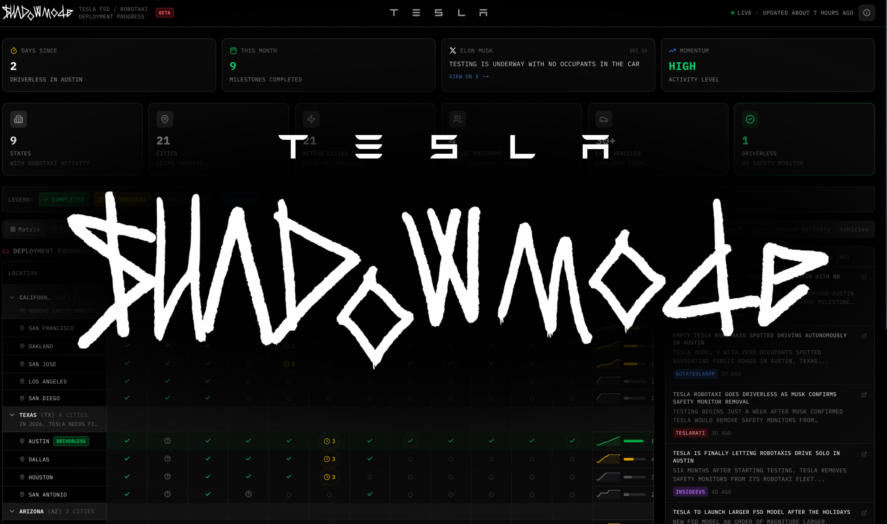

<p align="center">
  
</p>

<p align="center">
  <strong>Real-time intelligence on Tesla's autonomous future.</strong>
</p>

<p align="center">
  <a href="https://shadowmode.us">Live Dashboard</a> •
  <a href="#data-sources">Data Sources</a> •
  <a href="#api">API</a> •
  <a href="#contributing">Contributing</a>
</p>

<p align="center">
  
  
  
  
</p>

<p align="center">
  <a href="https://shadowmode.us">
    
  </a>
</p>

---

## What is this?

**SHADOWMODE** tracks Tesla's Unsupervised FSD (Robotaxi) regulatory approvals, deployments, and expansion signals across every active US market in real-time.

While Tesla operates in the shadows collecting billions of miles of training data, we're collecting something else: **the paper trail of the autonomous revolution.**

```
┌─────────────────────────────────────────────────────────────────────────────┐
│                                                                             │
│   ● LIVE   •   UPDATED 16 MINUTES AGO                      SHADOWMODE.US   │
│                                                                             │
│   ┌──────────┐  ┌──────────┐  ┌─────────────────────────┐  ┌──────────┐    │
│   │ 1 DAY    │  │ 9        │  │ @elonmusk               │  │ MOMENTUM │    │
│   │ SINCE    │  │ THIS     │  │ "Testing is underway    │  │ HIGH     │    │
│   │ DRIVER-  │  │ MONTH    │  │  with no occupants      │  │          │    │
│   │ LESS     │  │ MILES-   │  │  in the car"            │  │ ACTIVITY │    │
│   │ AUSTIN   │  │ TONES    │  │              VIEW ON X →│  │ LEVEL    │    │
│   └──────────┘  └──────────┘  └─────────────────────────┘  └──────────┘    │
│                                                                             │
└─────────────────────────────────────────────────────────────────────────────┘
```

<br />

## Live Stats

| Metric | Value | Description |
|--------|-------|-------------|
| 🏛️ **States** | 9 | With robotaxi activity |
| 🏙️ **Cities** | 21 | Being tracked |
| ⚡ **Active** | 21 | With any progress |
| 🚀 **Public Programs** | 4 | Test programs launched |
| 🚗 **Vehicles** | 135+ | Austin fleet alone |
| 🤖 **Driverless** | In Progress | Internal testing in Austin (public rides still have safety monitors) |

<br />

## Features

<table>
<tr>
<td width="50%">

### 📊 Matrix View
Progress grid showing every city across 13 regulatory milestones. Sort by progress, name, activity, or fleet size. Hover tooltips on each column header.

### 🗺️ Map View
Geographic visualization of Tesla's autonomous expansion. Watch the network grow.

### ⏱️ Timeline View
Chronological progression of milestones. See the velocity of approvals.

### 📈 Compare View
Side-by-side city comparisons. Who's ahead?

### 🏎️ AV Landscape
Competitive landscape panel tracking all major autonomous vehicle companies (Tesla, Waymo, Zoox, WeRide, Apollo Go, May Mobility, Avride).

</td>
<td width="50%">

### 📡 Hero Signal Ticker
Scrolling live ticker showing TSLA stock price, latest Elon tweets, @robotaxi tweets, fleet signals, and market status.

### ⏱️ Mission Clock
Large-format "Days Driverless" counter since Austin went fully driverless, with city deployment pills.

### 🌐 Deployment Pulse Map
Animated SVG map of all US AV deployments. Pulsing dots for autonomous services, color-coded by company.

### 📰 Live News Feed
Real-time aggregation from Google News RSS covering Tesla robotaxi developments. Auto-refreshes every 10 minutes.

### 𝕏 Elon Tweet Integration
Latest robotaxi-related tweets from @elonmusk displayed in real-time via Twitter syndication API.

### 🚗 Fleet Insights
Live fleet tracking: total vehicles, trips, miles, Tesla vs Waymo split, and per-city service area breakdowns.

</td>
</tr>
</table>

<br />

## Investor Intelligence

A suite of leading indicators and risk analysis tools for tracking Tesla's autonomous rollout:

<table>
<tr>
<td width="50%">

### 📋 Executive Summary
At-a-glance overview of key metrics: driverless markets, cities in progress, public test programs, and deployment velocity status.

### 🎯 Readiness Index
Weighted scoring algorithm measuring how close each market is to full autonomous deployment based on regulatory, operational, and infrastructure factors.

### ⏳ Time To Driverless
Estimated timeline projections for each city to achieve fully driverless status based on current milestone velocity.

### 📈 Rollout Velocity
Month-over-month deployment acceleration tracking with trend indicators (Accelerating / Stable / Slowing).

### 📊 Narrative Pressure Index
Market patience and execution momentum tracker featuring:
- **Proof Velocity**: Milestones achieved per month
- **Narrative Half-Life**: Catalyst freshness (Fresh/Active/Fading/Stale)
- **Regulatory Surface Area**: Exposure to restrictive states
- **Narrative Drift**: Story-led vs Execution-led positioning
- **What Changes the Stock**: Dynamic catalyst checklist
- **Last Catalyst Impact**: Historical price reaction data

</td>
<td width="50%">

### ⚖️ Regulatory Friction
Analysis of regulatory complexity by state, including permit requirements, insurance mandates, and approval timelines.

### 🛡️ Safety Signals
Tracking of safety-related metrics including disengagement reports, incident data, and regulatory compliance status.

### 💰 Economic Impact
TAM/SAM analysis for robotaxi markets including estimated revenue potential and ride volume projections.

### 🗣️ Public Trust Signal
Weighted sentiment analysis from surveys, social media, and news coverage measuring public perception of autonomous vehicles.

### 💹 Market Read
Dynamic investor implications based on deployment velocity trend, with actionable insights derived from execution data.

</td>
</tr>
</table>

<br />

## Email Alerts

Subscribe to get notified when new cities launch driverless robotaxi service:

- Real-time alerts for driverless milestones
- Powered by Supabase for reliable email delivery
- No spam, just milestone updates

<br />

## The Matrix

Every city is tracked across 13 regulatory and operational milestones:

| Column | Milestone | Indicator |
|--------|-----------|-----------|
| **INSURANCE** | Tesla Insurance available in state | ✓ / ✗ |
| **APPLIED** | Permit application filed | Date |
| **PERMIT** | Permit received/approved | Date |
| **OPERATOR ADS** | Vehicle operator job postings | Date |
| **FLEET ADS** | Fleet support job postings | Date |
| **APPROVAL** | Final regulatory approval | Date |
| **LIDAR TESTS** | HD mapping/validation in progress | Date |
| **APP ACCESS** | Robotaxi app access opens | Date |
| **TEST LAUNCH** | Public test program begins | Date |
| **EXPANDED** | Geofence expansion | Date |
| **VEHICLES** | Fleet size deployed | Count |
| **DRIVERLESS** | No safety monitor required | 🏆 |
| **PROGRESS** | Overall completion percentage | 0-100% |

### Status Legend

```
✓  COMPLETED     →  Milestone achieved, date confirmed
◐  IN PROGRESS   →  Underway but not complete  
○  NOT STARTED   →  No activity yet
?  UNKNOWN       →  Unconfirmed or conflicting data
—  N/A           →  Not applicable for this market
```

<br />

## Current Coverage

```
ARIZONA ────────────── Mesa/Tempe (50%) • Phoenix (42%)
CALIFORNIA ─────────── San Francisco (71%) • Oakland (63%) • San Jose (63%)
                       Los Angeles (25%) • San Diego (25%)
COLORADO ───────────── Denver (20%)
FLORIDA ────────────── Jacksonville • Miami • Orlando • Tampa
ILLINOIS ───────────── Chicago (20%)
MASSACHUSETTS ──────── Boston
NEVADA ─────────────── Las Vegas (50%)
NEW YORK ───────────── Brooklyn • Queens
TEXAS ──────────────── Austin (88% ◐ DRIVERLESS IN PROGRESS) • Dallas • Houston • San Antonio
```

**Notes displayed in dashboard:**
- 🔶 California: "To remove safety monitors, Tesla needs driverless tester permit..."
- 🔶 Florida: "Tesla Insurance not yet available in Florida"
- 🔶 New York: "Tesla Insurance not yet available in New York"  
- 🔶 Texas: "In 2026, Tesla needs final TxDMV authorization per S.B. 2807"

<br />

## News Feed

Live aggregation from major Tesla/EV news sources:

| Source | Type |
|--------|------|
| **TechCrunch** | Breaking news, regulatory updates |
| **Electrek** | Fleet numbers, Musk statements |
| **Teslarati** | Community sightings, deep dives |
| **InsideEVs** | Industry analysis |
| **NotATeslaApp** | App updates, feature tracking |

Recent headlines tracked:
- *"Tesla Starts Testing Robotaxis in Austin With No Safety Driver"* — TechCrunch
- *"Empty Tesla Robotaxis Spotted Driving Autonomously in Austin"* — NotATeslaApp
- *"Musk Slashes Tesla Robotaxi Fleet Goal From 500 to ~40 in Austin"* — Electrek
- *"NHTSA Opens New Investigation Into Tesla Full Self-Driving"* — TechCrunch

<br />

## Data Sources

```
┌──────────────────────────────────────────────────────────────┐
│                                                              │
│   California DMV ──────┐                                     │
│                        │                                     │
│   CPUC Filings ────────┼────► SHADOWMODE ────► Dashboard     │
│                        │           │                         │
│   Texas DMV ───────────┤           ├────► News Feed          │
│                        │           │                         │
│   Tesla Careers ───────┤           ├────► Elon Tweets        │
│                        │           │                         │
│   News APIs ───────────┤           └────► Activity Log       │
│                        │                                     │
│   Twitter/X API ───────┘                                     │
│                                                              │
└──────────────────────────────────────────────────────────────┘
```

| Source | Data Type | Update Frequency |
|--------|-----------|------------------|
| [CA DMV](https://www.dmv.ca.gov/portal/vehicle-industry-services/autonomous-vehicles/) | Permits, test authorizations | Weekly |
| [CPUC](https://www.cpuc.ca.gov/) | Driverless deployment permits | As filed |
| [TxDMV](https://www.txdmv.gov/) | Texas authorizations | Weekly |
| [Tesla Careers](https://www.tesla.com/careers) | Job postings (leading indicator) | Daily |
| News APIs | Announcements, coverage | Real-time |
| Twitter/X | @elonmusk robotaxi tweets | Real-time |
| SEC EDGAR | Official disclosures | As filed |

<br />

## Quick Start

```bash
# Clone
git clone https://github.com/yourusername/shadowmode.git
cd shadowmode

# Install
pnpm install

# Set up environment
cp .env.example .env.local
# Add your Supabase + Twitter API credentials

# Run migrations
pnpm db:migrate

# Seed with current data
pnpm db:seed

# Start dev server
pnpm dev
```

Open [http://localhost:3000](http://localhost:3000) and you're tracking.

<br />

## Environment Variables

```bash
# Supabase (for email subscriptions)
SUPABASE_URL=your_supabase_url
SUPABASE_SERVICE_KEY=your_service_key

# Twitter/X API (for Elon tweets)
TWITTER_BEARER_TOKEN=your_twitter_bearer_token
```

<br />

## Tech Stack

```
Next.js 16          App Router, React 19, Edge Runtime
React 19            Latest concurrent features
Supabase            Postgres + Realtime subscriptions
Tailwind CSS 4      Dark mode everything
Lucide React        Icon system
Vercel              Deployment + Cron jobs
Twitter Syndication @elonmusk tweet integration (15 parallel Nitter instances)
Google News RSS     News aggregation
Resend              Email notifications
```

<br />

## API

Available API endpoints:

```bash
# Get live news feed (Google News RSS)
GET /api/news

# Get Tesla stock price
GET /api/stock

# Get latest Elon / @robotaxi tweets
GET /api/tweets

# Get AV deployment data (all companies)
GET /api/av-data

# Get live fleet tracking data
GET /api/fleet

# Subscribe to email alerts
POST /api/subscribe
Content-Type: application/json
{ "email": "your@email.com" }

# Get subscriber count
GET /api/subscribe

# Send milestone update email to subscribers
POST /api/send-update

# Admin: manage milestone data
POST /api/admin/milestones
POST /api/admin/seed
```

<br />

## Project Structure

```
shadowmode/
├── src/
│   ├── app/
│   │   ├── layout.tsx            # Root layout + metadata
│   │   ├── globals.css           # Tailwind + custom animations
│   │   ├── city/[slug]/          # City detail pages
│   │   └── api/
│   │       ├── news/             # Google News RSS feed
│   │       ├── stock/            # Tesla stock price
│   │       ├── tweets/           # Elon + @robotaxi tweets
│   │       ├── av-data/          # AV deployment data (all companies)
│   │       ├── fleet/            # Live fleet tracking
│   │       ├── subscribe/        # Email signup
│   │       ├── send-update/      # Milestone email notifications
│   │       ├── og/               # Open Graph image generation
│   │       └── admin/            # Milestone + seed management
│   ├── components/
│   │   ├── RobotaxiDashboard.tsx # Main dashboard orchestrator
│   │   ├── ShadowmodeHero.tsx    # Hero: ticker + clock + pulse map
│   │   ├── HeroTicker.tsx        # Scrolling live signal ticker
│   │   ├── MissionClock.tsx      # Days driverless counter
│   │   ├── DeploymentPulseMap.tsx # Animated AV deployment map
│   │   ├── ProgressMatrix.tsx    # City × milestone grid
│   │   ├── AVLandscape.tsx       # Competitor landscape panel
│   │   ├── SidebarTabs.tsx       # Navigation sidebar
│   │   ├── FleetInsights.tsx     # Live fleet stats
│   │   ├── NewsFeed.tsx          # News aggregation
│   │   ├── USMap.tsx             # Interactive US map
│   │   └── ...                   # 20+ investor intelligence panels
│   ├── lib/
│   │   ├── seed-data.ts          # City/milestone seed data
│   │   ├── mockTrustData.ts      # Trust signal mock data
│   │   ├── trustScore.ts         # Trust score calculation
│   │   └── utils.ts              # Helpers, progress calc
│   └── types/
│       └── robotaxi.ts           # TypeScript type definitions
└── public/                       # Static assets + images
```

<br />

## Contributing

Found a new city deployment? Spotted an error? Have a news source we're missing? PRs welcome.

```bash
# Fork the repo
git checkout -b fix/houston-date-correction

# Make changes + commit
git commit -m "fix: correct Houston permit date to 2024-08-06"

# Push and open PR
git push origin fix/houston-date-correction
```

### Data Contributions

If you have verified information about Tesla Robotaxi deployments:

1. Open an issue with the `data-update` label
2. Include source URL (news article, official filing, etc.)
3. We'll verify and merge

<br />

## Roadmap

- [x] Core matrix dashboard
- [x] Real-time Supabase sync
- [x] Mobile responsive
- [x] Live news feed aggregation (Google News RSS)
- [x] Elon tweet integration
- [x] Momentum indicator
- [x] Days since counter
- [x] Progress percentages
- [x] Vehicle fleet visualization
- [x] State-level notes/context
- [x] Activity log (62+ events)
- [x] Interactive US map
- [x] Timeline view
- [x] Compare view
- [x] Email alerts signup (Supabase)
- [x] Executive Summary dashboard
- [x] Investor Intelligence suite
  - [x] Readiness Index
  - [x] Time To Driverless projections
  - [x] Rollout Velocity tracking
  - [x] Regulatory Friction analysis
  - [x] Safety Signals monitoring
  - [x] Economic Impact (TAM/SAM)
  - [x] Public Trust Signal
  - [x] Narrative Pressure Index
  - [x] Market Read (dynamic implications)
- [ ] Predictive model for next cities
- [x] Competitor tracking (Waymo, Zoox, WeRide, Apollo Go, May Mobility, Avride)
- [x] Hero signal ticker + Mission Clock
- [x] Deployment Pulse Map (multi-company)
- [x] Live fleet tracking
- [x] Sidebar navigation with tabs
- [x] Auto-refresh (10-minute page reload)
- [x] Milestone column hover tooltips
- [ ] Embeddable widgets
- [ ] Discord bot
- [ ] Push notifications

<br />

## Disclaimer

SHADOWMODE is an independent project and is not affiliated with, endorsed by, or connected to Tesla, Inc. in any way.

All data is sourced from publicly available information including government databases, regulatory filings, news reports, public job postings, and social media. We make no guarantees about accuracy or completeness.

This is not financial advice. Do your own research.

<br />

## License

MIT — do whatever you want with it.

<br />

---

<p align="center">
  <sub>Built by people who believe the future should be trackable.</sub>
</p>

<p align="center">
  <a href="https://shadowmode.us">shadowmode.us</a>
</p>
